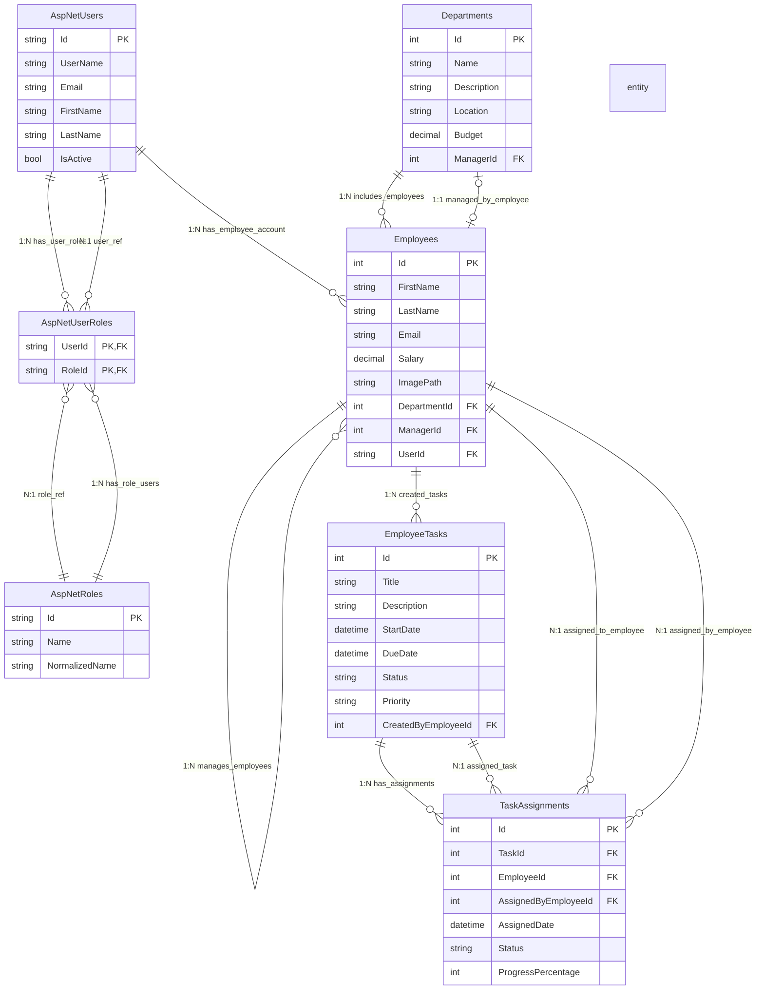
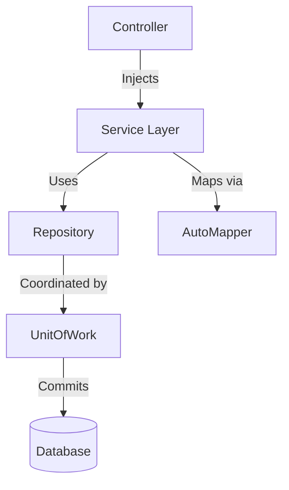

# Employee Management System

## Project Overview

The Employee Management System is a robust web application designed to streamline the management of employee data, departments, and tasks within an organization. Built with ASP.NET Core and adhering to Clean Architecture principles, this system provides a clear separation of concerns, making it highly maintainable, scalable, and testable. It offers comprehensive CRUD (Create, Read, Update, Delete) operations for employees, departments, and tasks, ensuring efficient data handling and organizational workflow.

## Key Features

*   **Employee Management**: Full CRUD operations for employee records, including personal details, contact information, and assigned departments.
*   **Department Management**: Efficient creation, retrieval, updating, and deletion of department information.
*   **Task Assignment and Tracking**: Assign tasks to employees, track their progress, and manage task details.
*   **User Authentication and Authorization**: Secure access control with user login and role-based permissions.
*   **Clean Architecture**: A well-structured codebase promoting maintainability, testability, and scalability through clear separation of layers.
*   **Responsive UI**: A user-friendly interface built with ASP.NET Core MVC, ensuring accessibility across various devices.

## Technical Stack and Dependencies

*   **Backend**: ASP.NET Core (.NET 9)
*   **Database**: SQL Server (with Entity Framework Core for ORM)
*   **Frontend**: HTML, CSS, JavaScript, jQuery, Bootstrap
*   **ORM**: Entity Framework Core
*   **Architecture**: Clean Architecture, Repository Pattern, Unit of Work Pattern
*   **Dependency Injection**: Built-in ASP.NET Core DI

## Project Structure

The project is organized into several layers, following the principles of Clean Architecture:
## Solution Structure

```plaintext
EmployeeManagement/
├── EmployeeManagement.Domain/         # Core business entities and interfaces
│   ├── Entities/                     # Domain models (Employee, Department, TaskItem)
│   └── Interfaces/                   # Repository contracts
│
├── EmployeeManagement.Application/    # Business logic and use cases
│   ├── Services/                     # Domain services implementation
│   ├── Interfaces/                   # Service contracts
│   └── DTOs/                         # Data Transfer Objects
│
├── EmployeeManagement.Infrastructure/ # Data access and external services
│   ├── Data/                         # DbContext and database configuration
│   ├── Repositories/                 # EF Core repository implementations
│   └── FileStorage/                  # Image handling service
│
├── EmployeeManagementSystem/          # Presentation layer (ASP.NET Core MVC)
│   ├── Controllers/                  # MVC Controllers
│   ├── Views/                        # Razor views
│   ├── ViewModels/                   # Presentation models
│   ├── wwwroot/                      # Static assets
│   └── Services/                     # Application services
│
└── EmployeeManagement.Tests/          # Unit and integration tests


```


## Entity Relationship Diagram (ERD) - Conceptual




## API Endpoints


### Departments
- `GET /Departments/Index` : Get all departments
- `POST /Departments/CreateModal` : Add a new department
- `POST /Departments/EditModal` : Edit an existing department
- `POST /Departments/DeleteModal` : Delete a department

### Employees
- `GET /Employees/Index` : Get all employees
- `POST /Employees/CreateModal` : Add a new employee
- `POST /Employees/EditModal` : Edit an existing employee
- `POST /Employees/DeleteModal` : Delete an employee

### Tasks
- `GET /Tasks/Index` : Get all tasks (filtered by user role)
- `POST /Tasks/Create` : Create a new task
- `POST /Tasks/UpdateStatus` : Update the status of a task


---

## 🏗️ Design Patterns Overview

### 1. Repository Pattern
- **Pattern overview:**  
  Abstracts data access, enabling business logic to work with interfaces instead of database code.
- **Key implementation points:**  
  - Concrete repositories (e.g., `GenericRepository<T>`, `EmployeeRepository`) implement shared interfaces.
  - All data access code is centralized in the Infrastructure layer.
- **Critical benefits:**  
  - Decouples business logic from data storage.
  - Enables easy swapping of databases and centralized query logic.
- **Technical impact:**  
  - Promotes rapid refactoring and unit testing.  
  - _Example:_  
    ```csharp
    public class EmployeeService
    {
        private readonly IEmployeeRepository _repo;
        // Only business logic here!
    }
    ```

---

### 2. Unit of Work Pattern
- **Pattern overview:**  
  Coordinates multiple repository actions in a single transaction—“all-or-nothing” saves.
- **Key implementation points:**  
  - `UnitOfWork` manages `DbContext` and all repositories.
  - Exposes a single `SaveChangesAsync()` to commit all changes together.
- **Critical benefits:**  
  - Ensures atomicity and consistency.
  - Batches multiple changes for performance.
- **Technical impact:**  
  - No partial saves; all related data is kept consistent.  
  - _Example:_  
    ```csharp
    _unitOfWork.Employees.Add(emp);
    _unitOfWork.Departments.Update(dep);
    await _unitOfWork.SaveChangesAsync();
    ```

---

### 3. Dependency Injection (DI)
- **Pattern overview:**  
  System injects dependencies into objects, avoiding manual instantiation—“plug-and-play” for services.
- **Key implementation points:**  
  - Services and repositories registered in `Program.cs`.
  - Dependencies provided via constructor injection.
- **Critical benefits:**  
  - Loose coupling, easy testing, and flexible scaling.
- **Technical impact:**  
  - Controllers/services are clean, focused, and easily testable.  
  - _Example:_  
    ```csharp
    public class DepartmentsController
    {
        public DepartmentsController(IDepartmentService service) { ... }
    }
    ```

---

### 4. AutoMapper
- **Pattern overview:**  
  Automates mapping between entities and ViewModels/DTOs.
- **Key implementation points:**  
  - Mapping configured in `MappingProfile.cs`.
  - Used extensively in services for clean object transformations.
- **Critical benefits:**  
  - Eliminates boilerplate mapping code.
  - Centralizes and simplifies property mapping maintenance.
- **Technical impact:**  
  - Less error-prone and more maintainable code.  
  - _Example:_  
    ```csharp
    var employeeVM = _mapper.Map<EmployeeViewModel>(employee);
    ```

---

#### 🔎 Visual Summary



---


## Installation and Running the Project

### 1. Clone the Repository

Open your terminal or command prompt and run the following command to clone the project:

```bash
git clone https://github.com/MostafaElmarakpy/EmployeeManagement.git
cd EmployeeManagement
```

### 2. Database Setup

#### a. Update Connection String

Open the `appsettings.json` file located in the `EmployeeManagementSystem` project (`EmployeeManagement/EmployeeManagementSystem/appsettings.json`). Update the `DefaultConnection` string to point to your SQL Server instance.

```json
{
  "ConnectionStrings": {
    "DefaultConnection": "Server=YourServerName;Database=EmployeeManagementDb;Trusted_Connection=True;MultipleActiveResultSets=true;TrustServerCertificate=True"
  },
  // ... other settings
}
```

Replace `YourServerName` with the name of your SQL Server instance (e.g., `.` for localdb, `(localdb)\MSSQLLocalDB`, or your server's IP address/hostname).

#### b. Apply Migrations

Navigate to the `EmployeeManagementSystem` directory in your terminal:

```bash
cd EmployeeManagement/EmployeeManagementSystem
```

Run the following .NET Entity Framework Core commands to create the database and apply migrations:

```bash
dotnet ef database update
```

This command will create the `EmployeeManagementDb` database (if it doesn't exist) and apply all pending migrations, setting up the necessary tables and initial data.

### 3. Run the Application

After setting up the database, you can run the application from the `EmployeeManagementSystem` directory:

```bash
dotnet run
```


